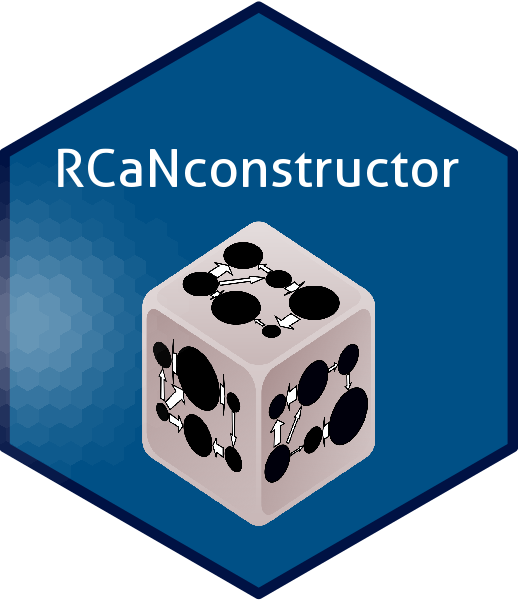

# CaN

## RCaNconstructor installation
There are two way for installing RCaNconstructor.

### Binaries
We provide binaries for different platforms that can be used to facilitate the installation:
* [linux deb](target/rcanconstructor.deb)
* [mac os](target/rcanconstructor.dmg)
* [windows](taget/rcanconstructor.exe)

### From source
To build RCaNconstructor from source, the easiest solution is to use maven to manage all dependencies.
The procedure will automatically build appropriate binaires for your platform. This was made possible thanks to the template provided [here](https://github.com/wiverson/maven-jpackage-template):
* install maven (at least version 3.3.2) and ensure that the maven/bin folder is in your system path
* install java (at least version 16)
* download the RCaNconstructor folder from this repository
* After cloning the RCaNconstructor folder
* run `mvn clean install` in the the RCaNconstructor folder
* this will generate a binary in the target folder

