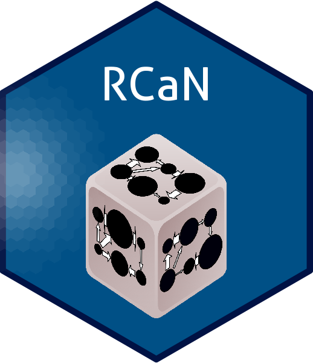

# CaN

## RCaN installation
For RCaN installation, please look [here](RCaN/README.md)

## RCaNconstructor installation
For RCaNconstructor installation, please look [here](https://github.com/inrae/RCaN/releases) (click on "Assets" in the section corresponding to your platform)
