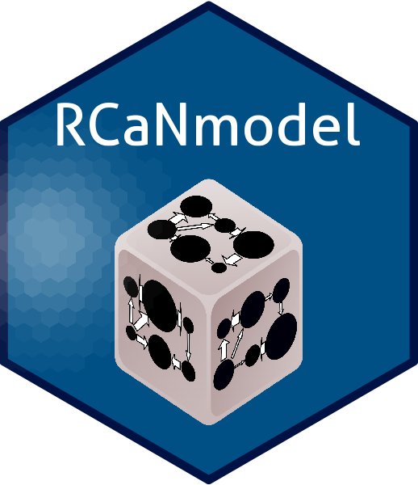

# CaNmodel

## What is CaNmodel aimed at? Statement of need
RCaNmodel and RCaNmodelconstructor primarily aim at implenting food-web models based on a
Chance and Necessity approach. Details and relation with pre-existing tools can be found in 
the statement of need of this [document](paper/paper.md).
As a summary, those model focus on trophic exchanges between preys and predators while accouting
for the intrinsic stochasticity of nature and the existence of physical laws. The R package RCaNmodel 
facilitates the modelling process (model construction and validation, model exploration, output analysis),
while the RCaNconstructor GUI provides an interactive/intuitive interface to support 
a participatory framework.

Since version 2, a new facility was introduced that allow the user to specify the dynamic of the system.
With such a model, the user specifies of the dynamics of compartments depending on incoming and outputing fluxes and
the tool then simulates the dynamics of the whole systems accounting for additional constraints. This allow to extend
the Chance and Necessity approach beyond usual food-web models. A vignette is currently under construction. An example
of such model is provided with the package:

> system.file("extdata", "CaN_template_mini_generic.xlsx", package = "RCaNmodel")

Version 2 also includes a tool called RCaNExplorer that facilitates the interactive
and fast exploration of the results.

 

## RCaNmodel installation
For RCaNmodel installation, please look [here](RCaNmodel/README.md)

## RCaNconstructor installation
For RCaNconstructor installation, please look [here](https://github.com/inrae/RCaNmodel/releases) (click on "Assets" in the section corresponding to your platform)

## RCaNconstructorShiny
Besides the former java RCaNconstructor, there is now a Shiny RCaNconstructor to build RCaN file. This avoids the installation of extratools. More info can be found [here](RCaNconstructorShiny/README.md)

## RCaNExplorer installation
Further information is available [there](https://github.com/TanguyGen/RCaNExplorer)

## Usage
A vignette is provided with the package to explain how it should be used.

## Contributing
Any peoples interested can contribute by filling bug or providing feature request as [Issues on GitHub](https://github.com/inrae/RCaNmodel/issues). 
If you want to suggest new pieces of code, please fork the project and create a pull request:
- Fork the Project
- Create a new branch (git checkout -b feature/mybranch)
- edit the code and commit the changes (git commit -m 'this is the changes to be reviewed')
- Push (git push origin feature/mybranch)
- Open a [Pull Request](https://github.com/inrae/RCaNmodel/pulls).  

