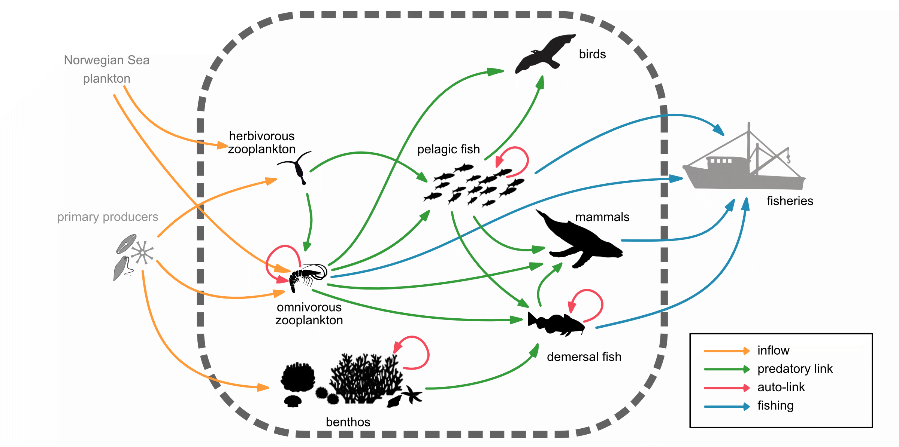

```{r label=setup, include=FALSE}
require(knitr)
knitr::opts_chunk$set(echo=TRUE)
require(DT)
require(dplyr)
require(coda)
require(ggplot2)

hook_output <- knit_hooks$get("output")
knit_hooks$set(output = function(x, options) {
  lines <- options$output.lines
  if (is.null(lines)) {
    return(hook_output(x, options))  # pass to default hook
  }
  x <- unlist(strsplit(x, "\n"))
  more <- "..."
  if (length(lines)==1) {        # first n lines
    if (length(x) > lines) {
      # truncate the output, but add ....
      x <- c(head(x, lines), more)
    }
  } else {
    x <- c(more, x[lines], more)
  }
  # paste these lines together
  x <- paste(c(x, ""), collapse = "\n")
  hook_output(x, options)
})

```

# Introduction
In this Supplementary Information document, we present an example of a RCaN study. 

It corresponds to the Barents Sea ecosystem that is presented in the paper. The exemple has the exact same structure as in the paper: same trophic structure (@lindstrom2017multiple), same trophic parameters (@lindstrom2017multiple), same set of time series of observations. However, the specific values of the times series were slightly modifided since some of them are not public (but most of them can be provided on demand.

The network is illustrated in  figure \@ref(fig:network-figure). 

```{r network-figure, echo=TRUE, fig.cap='The Barents Sea tropic network', fig.align='center', out.width='60%'}

```

The RCaN file has been previously built, using the RCaN constructor; it is attached to this supplementary information. All following commands give rise to R-Markdown file that is also attached. 

It is organized as follows: 

* We give a short glance to the RCaN-file.
* Then we run main steps of the method after the construction of the RCaN file: (a) build polytope, (b) analyze polytope by inserting and removing constraints, (c) compute sample, (d) analyze sample. 


# Preliminary: R Environment

Firstly you need to install R (version xx) and Rstudio on your omputer. 

Then RCaN has to be downloaded. This is done once for all The installation instructions are given in the [ReadMe](https://github.com/inrae/RCaN) file of the package .

```{r label=install, echo=TRUE} 
# if (!require("RCaN")) {
#  require(devtools)
#  devtools::install_git(
#    "https://gitlab.irstea.fr/hilaire.drouineau/can.git",
#    subdir="RCaN")
#  }
```

Then, the library can be loaded

```{r label=libraries, echo=TRUE, message=FALSE, results='hide'}
library(RCaN) #the RCaN package itself
```

## Doing the same with RCaNConstructor

```{r ,fig.align='center', echo=FALSE,  out.width='20%'}
knitr::include_graphics("Network.png")
```

* You need an implementation of R.
* Install RCaN with the above R Commands;
* Start RCaNconstructor
* RCaN - Install libraries

# The RCaN file {#rcanfile}

Parameters, observations and constraints have been gathered in a file with a .xlsx structure. This is what is called a RCaN file. You may edit it with any spreadsheet program. Then be careful: some consistencies between entities can be lost. This is one of the main reason why it is better to manage data with the RCaNconstructor.

```{r label=data}
NAMEFILE <- 'BarentsSeaDummy.xlsx'
```

Once the RCaN file is ready, you can import it automatically with the following command:


```{r label=build, echo=TRUE}
system.time(CaNmod <- buildCaN(NAMEFILE))
```

The RCaN file is composed of 4 sheets (at least) which are read and used by *buildCaN* to construct the model. Let's know explore the content of the RCaN file.

### Components

Components correspond to the tropho-species in the systems  (figure \@ref(fig:network-figure)). They are specified in the "Components & input parameter" of the RCaN file, with their Id (column Component), a flag to indicate whether they are inside or outside the system (column Inside) and their biological characteristics. These biological characteristics are used to implement implicit constraints (mass conservation, inertia, satiation, fluxes and biomasses minimal value).

All this information is saved as is in a dedicated dataframe in the CaNmod object:

```{r label=components, echo=TRUE}
datatable(CaNmod$components_param[c(1:8)], caption='Components')
```
In the example, the system has `r nrow(CaNmod$components_param)` components, `r sum(CaNmod$components_param$Inside)` of which are internal.


### Fluxes

Fluxes correspond to the transfer trophic interraction among tropho-species (i.e., arrows in  figure \@ref(fig:network-figure)). They are specified in the "Fluxes" of the RCaN file, identified by an Id (column Flux), their tropho species of origin (column From) and of destination (column To) and a flag to indicate whether is it a Trophic interraction or not (column Trophic). All this information is saved as is in a dedicated dataframe in the CaNmod object. 

```{r label=fluxes, echo=TRUE}
datatable(CaNmod$fluxes_def, caption='Fluxes')
```
In the example, the system includes `r nrow(CaNmod$fluxes_def)` fluxes, `r sum(CaNmod$fluxes_def$Trophic)` of which corresponding to trophic fluxes.

## Observations

Observations correspond to different monitoring time series related to the sustem. They have been collected from (@lindstrom2017multiple, @dalpadado2014productivity) but are slightly modified here since some data are not public. They are stored in  "Input time-series" sheet in the RCaN file, with a row per year and a column per time series. The first row provides an Id for the corresponding time series. All this information is saved as is in a dedicated dataframe in the CaNmod object. :

```{r label=observations, echo=TRUE}
datatable(CaNmod$series,caption="Observations")
```
In the exemple, we have `r ncol(CaNmod$series)` time series of observations.

## Constraints {#constraints}

In additions to implicit constraints, explicit constraints can be specificied in the RCaN file. They are written in the form of inequalities or equalities using the Id of either Components, Fluxes or sries and scalar values. They are provided in the sheet "Constraints" of the RCaN file with an Id (first colum), the equality/inequality that species the constraint (column Constraint), the year in which the constraint takes place and a flag to indicate whether the constraint should be used by default or not. The information is stored as is in a dataframe in the CaNmod object.


```{r label=constraints, echo=TRUE}
datatable(CaNmod$constraints[,1:5],caption='Constraints defined by user')
```

Here, the model includes `r nrow(CaNmod$constraints)`, `r sum(CaNmod$constraints$Active)` of them are active by default.

## Doing the same with RCaNConstructor


```{r ,fig.align='center', echo=FALSE,  out.width='20%'}
knitr::include_graphics("Network.png")
```

* File - Open
* File - New
* Views - Network (graphically add, remove or edit components)
* Views -  Components (add, edit or remove components)
* Views - Fluxes (add, edit or remove fluxes)
* Views - Observations (add, edit or remove observations, while specifying meta information)
* Views - Constraints (add, edit or remove constraints)


# The polytope behind a CaNmod object
In section \@ref(rcanfile), we used to the `buildCaN` function to read the RCaN file. This function does not only read the file, but also construct all the underlying matrices that describe the dynamics of the system and the polytope defined by the constraints that corresponds to the "space of possibles".

```{r label=canmoddescription, echo=TRUE}
names(CaNmod)
```

Matrices C and A, and vectors b and v correspond to the matrices of active constraints that define the polytope A X <= b and C X = v (AAll, CAll, bAll and vAll are similar but include all constraints, active or not). Matrices N, H, F and L are matrices that are used to describe the dynamics of the system, more specifically, they describe how biomasses at any time can be derived from flow, using the relationship. We won't enter into details here but the mathematical details are provided in the supplementary material of Planque and Mullon @planque2019modelling.

## Structure of the polytope

The polytope is defined inside a space with a very high number of dimensions. 

For the Barents sea example, we have:

```{r label=dims, echo=TRUE}
paste("number of inequalities:", nrow(CaNmod$A))
paste("number of equalities:", nrow(CaNmod$C))
paste("number of parameters:", ncol(CaNmod$C))
```
The inequalities and equalities result from both implicit and explicit constraints, each line corresponds to a constraint and a specific year. The number of parameters correspond to the the number of fluxes multiplied by the number of years, plus the number of inside components.


## Checking the polytope

This is an important step. Users can display different strategy: some users try first to specificy as much constraints as possible with the risk of achieving an empty polytope and the need to simplify the model. Others tend to start with very simple models, not using time series for example, with the risk of having an unbounded polytope and the need to add extra constraints. It is not our objective here to describe the pros and cons of each strategy and how to implement them: here we just focus on how to detect potential issues and give quick keys on how to solve them.

### First step: checking the polytope

As it is defined in the RCaN file for the Barents' sea, the polythene is appropriately bounded.


```{r label=rmppcheck, echo=TRUE, warning=FALSE}
checkPolytopeStatus(CaNmod)
```

However, in some situations, the function may informs you the the polytope is unbounded, or on the contrary that is open. In such a situation, it might be necessary to add/activate new constraints (or on the contrary to disactivate constraints.)

### Toggling constraints and detecting incompatible constraints
Just as an illustration, we illustrate here how to activate/disactivate constraints.

```{r label=rmpp, echo=TRUE, output.lines=1:10}
CaNmod <- toggleConstraint(CaNmod,
                           c(paste0("C", formatC(1:12,
                                          width = 2,
                                          format = "d",
                                          flag = "0")),
                             "C15","C16","C19","C21"))
```
In this example, we removed all the constraints that bound the input (primary production), the output of the system (fisheries) and maximum biomasses of top predators (birds and marine mammals).

```{r label=inconsistencheck, echo=TRUE, warning=FALSE}
checkPolytopeStatus(CaNmod)
```
As a result, you can see that the polytope is unbounded. As a consequence, we reactivate the constraint

```{r label=reactpp, echo=TRUE, output.lines=1:10}
CaNmod <- toggleConstraint(CaNmod,
                           c(paste0("C", formatC(1:12,
                                          width = 2,
                                          format = "d",
                                          flag = "0")),
                             "C15","C16","C19","C21"))
```

### Finding incompatible constraints

Here the polytope is ok (not empty), but we artificially add an incompatible constraint to illustrate the opposite situation.

```{r label=addincompatible, output.lines=1:10}
CaNmod<-toggleConstraint(CaNmod, "C35")
```
If you look at the section \@ref(constraints), you will see that constraint C35 is totally incompatible with constraints C21. As a consequence, we now get 

```{r label=checkincompatible, warning=FALSE}
checkPolytopeStatus(CaNmod)
```
Unsurprisingly, the polytope is detected as empty. We can now try to detect which constraints raise problems:

```{r inconstistent, output.lines=1:10}
incomp <- findingIncompatibleConstr(CaNmod)
```

The routine informs you that the constraint C35 raises problem (see ###polytope is ok when following constraints are relaxed) and that it is incompatible with constraints C16 and C17 ("####Those constraints seem incompatible with:").
Let's now disactivate the problematic contraint to follow up.

```{r label=disactincompatible, output.lines=1:10}
CaNmod<-toggleConstraint(CaNmod, "C35")
```


## Bounds of the polytope
We want to have a first overview of the polytope. One way is computing its limits in all dimensions and they are a lot using the function *getAllBoundsParam*. Result is a dataframe with a row per parameter. It is a time consuming command so here we restict the analysis to a single parameter with the function *getBoundParam*. 

```{r label=boundsC}
getBoundParam(CaNmod, which(colnames(CaNmod$A)=="Ozoo_Birds[2018]"))
getBoundParam(CaNmod, which(colnames(CaNmod$A)=="Ozoo_Birds[2017]"))

```

## Slices of the polytope

2-dimensional pictures of the polytope is obtained as follow: 

```{r label=fig1, out.width='100%'}
start_time <- Sys.time()
fluxX1 <- paste('PP_Ozoo','[1990]',sep="")
fluxY1 <- paste('Hzoo_Ozoo','[1990]',sep="")
plotPolytope2D(CaNmod, c(fluxX1, fluxY1), progressBar=FALSE)
fluxX2 <- paste('Hzoo_PelF','[1990]',sep="")
fluxY2 <- paste('PelF_PelF','[1990]',sep="")
plotPolytope2D(CaNmod, c(fluxX2, fluxY2), progressBar=FALSE)
fluxX3 <- paste('Hzoo_PelF','[1990]',sep="")
fluxY3 <- paste('Hzoo_PelF','[1991]',sep="")
plotPolytope2D(CaNmod, c(fluxX3, fluxY3), progressBar=FALSE)
fluxX4 <- paste('Hzoo_PelF','[1990]',sep="")
fluxY4 <- paste('PelF_Fisheries','[1991]',sep="")
plotPolytope2D(CaNmod, c(fluxX4, fluxY4), progressBar=FALSE)
end_time <- Sys.time()
end_time - start_time
```

## Doing the same with RCaNConstructor


```{r ,fig.align='center', echo=FALSE,  out.width='20%'}
knitr::include_graphics("Network.png")
```

* RCaN - Polytope - Build polytope
* RCaN - Views - Constraints : edit the Active parameter, add or remvove constraints
* RCaN - Polytope - Analyze polytope - Plot polytope in two selected dimensions
* RCaN - Polytope - Analyze polytope - Plot network
* RCaN - Polytope - Analyze polytope - Diagnostic polytope
* RCaN - Polytope - Analyze polytope - Find incompatible constraints


# Sampling the polytope

## Sampling

The sampling of the polytope, that is the building many random possible trajectories, is accomplished with the RCaN command (see Vignette), where 
* N is
* thin is 
* nchains is
* ncore is

```{r label=sample}
system.time(samples <- sampleCaN(CaNmod, N=100, thin=1, nchain=2, ncore=2))
```

The output of this command is a mcmc object (defined in package coda).

## Convergence of the sample chains

We want to check the mixing of the Monte Carlo Marko chain algorithm that is used to build the sample. 

For that purpose, we use commands from the [coda](https://cran.r-project.org/web/packages/coda/index.html) library. 

```{r label=nchain}
summ <- summary(samples$mcmc)

datatable( cbind.data.frame(summ$statistics, summ$quantiles) %>%
             select('Mean', 'SD', '2.5%', '50%', '97.5%'),
           options = list(pageLength = 31)) %>%
  formatRound(attr(.$x,"colnames"))
```

### Gelman diagnostic 

Gelman and Rubin (1992) propose a general approach to monitoring convergence of MCMC output in which $ m > 1$ parallel chains are run with starting values that are overdispersed relative to the posterior distribution. Convergence is diagnosed when the chains have 'forgotten' their initial values, and the output from all chains is indistinguishable. The gelman.diag diagnostic is applied to a single variable from the chain. It is based a comparison of within-chain and between-chain variances, and is similar to a classical analysis of variance.

```{r label=gelman, echo=TRUE, warning=FALSE, message = FALSE, out.width='100%'}
fluxZ1 <- paste('PP_Benthos','[1990]',sep="")
fluxZ2 <- paste('Ozoo_Birds','[1990]',sep="")
fluxZ3 <- paste('DemF_Fisheries','[1990]',sep="")
fluxZ4 <- paste('PelF_DemF','[1990]',sep="")
gelman.diag(samples$mcmc[,c(fluxZ1,fluxZ2,fluxZ3,fluxZ4)], multivariate = FALSE)
```

The Gelman diagnostic compares the variance intrachain to the variance interchain. Theoretically a statistics below 1.05 suggests an appropriate convergence.

### Autocorrelation function 

The *acfplot* function shows the autocorrelation of sampling chains. It is illustrative of the independence of successive samples. If the samples are not serially correlated (which is desired) the autocorrelation should remain around zero (except for the first value which is always 1). Otherwise, it might be worthwhile thinning the chains.

```{r label=acf, echo=TRUE, warning=FALSE, message = FALSE, out.width='100%'}
fluxZ1 <- paste('PP_Benthos','[1990]',sep="")
fluxZ2 <- paste('Ozoo_Birds','[1990]',sep="")
acfplot(samples$mcmc[,fluxZ1], ylim=c(-0.1,0.8), main= fluxZ1)
acfplot(samples$mcmc[,fluxZ2], ylim=c(-0.1,0.8), main=fluxZ2)
```

Here we see that for both two considered parameters, the autocorrelation among iterations is very limited suggesting that the thinning is appropriate and burnin is appropriate. Otherwise, it might be worthwile increasing the thinning, the number of samples and to discard first samples.


## Food-web dynamics. Components

We want to observe the variability of the sampled trajectories. 

To that purpose, we use the function *ggSeries*. It plots the time series of individual or collections of components and/or fluxes. By default, 3 randomly picked samples are plotted (plain, dashed and dotted lines) together with the envelopes containing 100\%, 95\% and 50\% of the samples. 

For components, we get:

```{r label=dynamicsComponents, echo=TRUE, warning=FALSE, message = FALSE, out.width='100%'}
g <- ggSeries(samples, CaNmod$species, TRUE)
g + scale_y_log10() + guides(color=FALSE, fill=FALSE)
```

Here we observe different situations among species: for PelF and DemF, time series provide enough information to constrain the trajectories of biomasses. On the other hand, marine mammal and Birds are less constrained and are not limited by their satiation nor their inertia, leading to large variations among trajectories.


## Food-web dynamics. Fluxes

For fluxes, we get:

```{r label=dynamicsFluxes, echo=TRUE, warning=FALSE, message = FALSE, out.width='100%'}
g <- ggSeries(samples, CaNmod$flow, TRUE)
g + scale_y_log10(n.breaks=3) + scale_x_continuous(breaks=c(1990,2010)) + guides(color=FALSE, fill=FALSE)
```


## Distribution of values. Components

We want a descriptive function of the distributions of values for elements of the network at a given year.

To that purpose, we use the function *ggViolin*.   

For components, in 1990, we get:

```{r label=distribComp90, echo=TRUE, warning=FALSE, message = FALSE, out.width='100%'}
g <- ggViolin(samples,CaNmod$species,year=1990,TRUE) 
g + xlab('Component') + ylab('Biomass')
```
This graph confirms the previous observations: large distributions for some species (Hzoo, Birds) but show that, despite differences can still be detected among species.

## Distribution of values

For fluxes in 1990, we get:

```{r label=distribFlux90, echo=TRUE, warning=FALSE, message = FALSE, out.width='100%'}
g <- ggViolin(samples,CaNmod$flow,year=1990,TRUE) 
g + xlab('Component') + ylab('Biomass') + theme(axis.text.x=element_text(angle=90))
```


Fluxes correspond to the sampled parameters of a CaN model. We see here that some fluxes are totally determined by the constraints (Fisheries data), but that most of them display large distributions. However, it still possible to detect differences among fluxes and this still leads to differences among biomasses.

## Diet composition

The diet matrix is a key parameters of a trophic model such as ecopath. Here, diet is non deterministic, as such, it is intersting to explore the result. A convenient way is to use the *ggDiet* function that display the average diet of predators.

For all predators, we get:

```{r label=diet, echo=TRUE, warning=FALSE, message = FALSE, out.width='100%'}
g <- ggDiet(samples, CaNmod$species) 
g + ylab('prey proportion in the diet')
```


## Growth

We want to analyze density-dependence effects in the trajectories.

To that purpose, we use the function *ggGrowth*. It  plots the growth rate (measured as the ratio of biomass at time $ t+1 $ over the biomass at time $ t $) as a function of the biomass (at time $ t $). This figure illustrate how density-dependence of single components can emerge from the food-web dynamics. The upper and lower red-dotted lines visualise the minimum and maximum growth rates set by the inertia constraints for each component.

For all components over the entire sampling period, we get:

```{r label=growth, echo=TRUE, warning=FALSE, message = FALSE, out.width='100%'}
ggGrowth(samples, CaNmod$species)
```

We observe: To be written

## Trophic functional relationships


```{r label=trophicRelationship,echo=TRUE, warning=FALSE, message = FALSE, out.width='100%'}
ggTrophicRelation(samples, CaNmod$species[3:5])
```
The function *ggTrophicRelation*  plots the empirical relationships between the biomass of a prey and the quantity of that prey consumed by a predator. Above, we see that the predation of benthos by demersal fishes does not increases with the biomass of benthos, suggesting that benthos is not a limiting factor in the diet of demersal fishes.


## Satiation

```{r label=satiation, echo=TRUE, warning=FALSE, message = FALSE, out.width='100%'}
ggSatiation(samples, CaNmod$species)
```

The function *ggSatiation* plots the total biomass of prey eaten by a predator, as a function of the biomass of the predator. In addition the plot includes an indication (upper red dotted line) of the maximum possible consumption rate, derived from the satiation parameter of the predator species. An example is illustrated below for all model components and over the entire sampling period. It shows that marine mamammals never reach their satiation. On the other hand, demersal fishes are often closed to satiation, suggesting that they are not food limited.

## Feeding and Growth

```{r label=feedingGrowth, echo=TRUE, warning=FALSE, message = FALSE, out.width='100%'}
ggSatiatInertia(samples, CaNmod$species)
```

The function *ggSatiatInertia* is used to explore the relationships between population growth and feeding. The plot shows standardized total consumption(0=no feeding, 1=feeding to satiation) as a function of standardized population growth/mortality (-1 = maximum mortality, 0 = no change in biomass, 1 = maximum growth). A positive relationship between growth and satiation is indicative of bottom up control.

## Pair plots

For two components:

```{r label=plotPairs, echo=TRUE, warning=FALSE, message = FALSE, out.width='100%'}
g <- ggPairsBiomass(samples,c("Benthos","PelF","DemF"),logscale=FALSE, frac = .25) #we only 25% of the point since the function is long
g +  scale_y_continuous(n.breaks=3)+ scale_x_continuous(breaks=c(1990,2010))
```

The function *ggPairsBiomass* is used to explore the relationships between the biomass of different food-web components. The plot shows the individual component density function in the diagonal, the scatterplots of one species against the other in the lower triangle and the Kendall correlation coefficient in the upper triangle. An example is illustrated below for all model components and over the entire sampling period.

## Control Bottom Up
```{r label=bottomup, echo=TRUE, warning=FALSE, message = FALSE, out.width='100%'}
g <- ggTopDownBottomUp(samples) #we only 25% of the point since the function is long
g
```
This function display the correlation between the growth of the species with both (1) its total ingestion of prey per unit of biomass (in red) and (2) the how much it is predated per unit of biomass (in blue). A red density plot tending to 1 indicates that growth is correlated to feeding, and therefore a bottom up control. Conversely, a blue density plot tending to minus one indicates that growth is negatively correlated to the predation and suggests a top down control. It is possible to select which fluxes are accounted for in this diagram (for example to exclude non trophic fluxes):

```{r label=bottomupres, echo=TRUE, warning=FALSE, message = FALSE, out.width='100%'}
# we restrict the analysis to Ozoo and DemF and limit to the predation by
#respectively DemF/PelF and MM
g <- ggTopDownBottomUp(samples, species=list(Ozoo=c("DemF","PelF"), DemF=c("MM"))) 
g
```

## Doing the same with RCaNConstructor

```{r ,fig.align='center', echo=FALSE,  out.width='20%'}
knitr::include_graphics("Network.png")
```

* RCaN - Sample - Sample polytope
* RCaN - Sample - Analyze polytope - Gelman diagnostic
* RCaN - Sample - Analyze polytope - Plot autocorrelation of sample
* RCaN - Sample - Analyze polytope - Plot sample
* RCaN - Sample - Analyze polytope - Violin plots of biomass distributions
* RCaN - Sample - Analyze polytope - Violin plots of flux distributions
* RCaN - Sample - Analyze polytope - Diet fractions 
* RCaN - Sample - Analyze polytope - Growth / Biomasses
* RCaN - Sample - Analyze polytope - Trophic functional relationships       
* RCaN - Sample - Analyze polytope - Satiation
* RCaN - Sample - Analyze polytope - Satiation/Inertia
* RCaN - Sample - Analyze polytope - Pairs of biomass


# References
